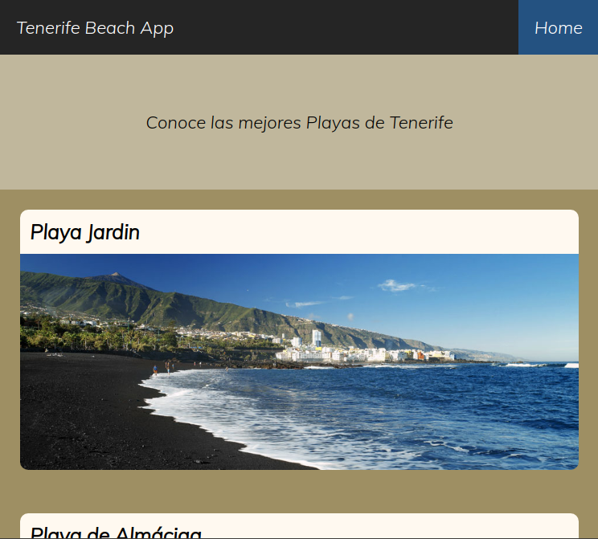

# Tenerife Beach App

This is App create in React.
What it does is show some of the beaches of Tenerife. Through a connection to a REST API make with Python.

TenerifeBeachApp Link: https://albertocruzluis.github.io/TenerifeBeachApp/#/

Repository of TenerifeBeachApi: https://github.com/AlbertoCruzLuis/TenerifeBeachApi